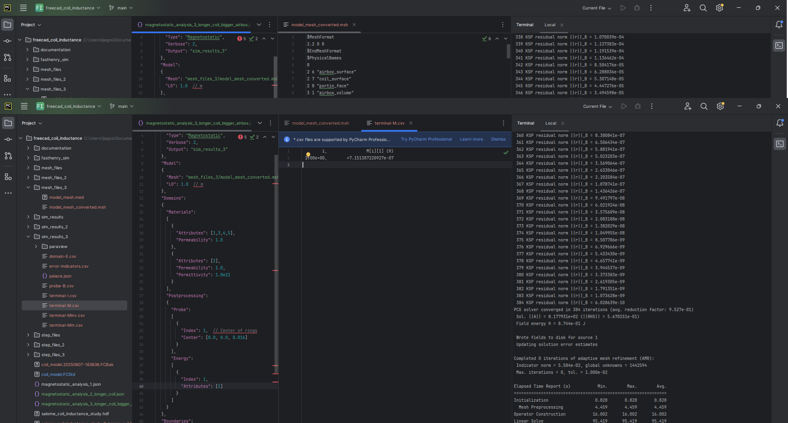
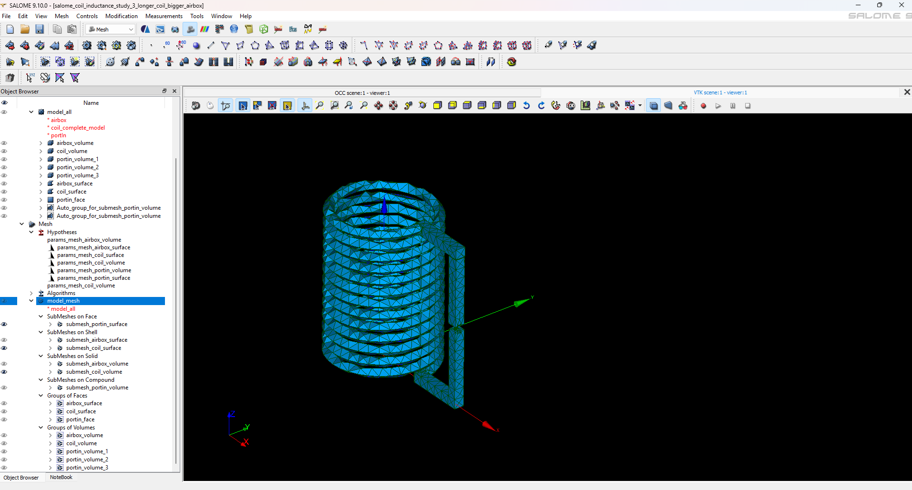

# coil inductance
This demo shows how to setup magnetostatic simulation right to get inductance of coil. Palace evaluate mutual inductance, in this case coil is modeled as solid and there is just one port therefore output is coil inductance itself.
I put here now 3 simulation since I tried this:
  1. there was small boundaries and got inductance 600nH what seems to be lower than internet calculator, 5 turns of wire
  2. tried to increase number of turns to 13 to got bigger inductance and eliminate problem that diameter is almost same size as coil height
  3. increase airbox to see if it's size has effect on result inductance

I compared output to this:
  - FastHenry: 820nH
  - online slenoid calculator: 840nH but I must put into calculation smaller diameter my model have diameter 10mm and got similar result after I change it in solenoid calculation to 9.2mm

I think simulation is set right but depends on dimension, results seems to be close enough for me so I think this simulation should be set right.

