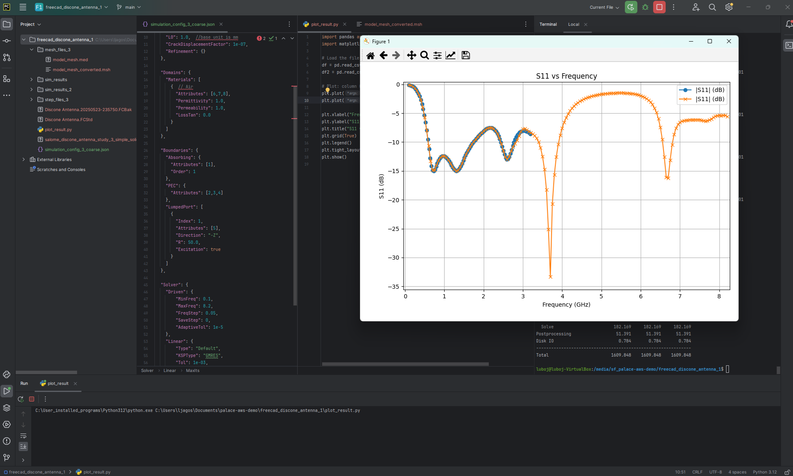
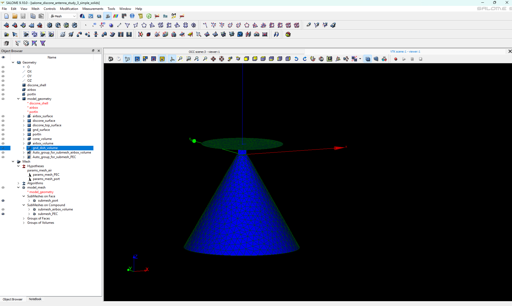

# discone antenna simulated in palace aws
Classic example of discone antenna. To make simulation runing important was create mesh right, main problem was that at first I created in FreeCAD cone and gnd just as plain
face no as solid and export them, there is problem to create right mesh using partitioning in salome.
Therefore right workflow to create right mesh is this:
  1. create in FreeCAD antenna model where gnd dish and cone are solids as in attached freecad
  2. import solids into salome
  3. create partition object from gnd dish, cone object, airbox
  4. explode object to obtain volumes, faces, shells
  5. delete unecessary objects and left just air surface, volume, gnd bottom surface and volume, cone surface and volume, port surface
  6. create mesh air mesh consist from airbox volume, cone inner object volume, gnd dish volume
  7. create PEC mesh from bottom gnd surface and cone surface

This is important. When mesh was created wrong palace simulation doesn't started there was just basic info written in command line and nothing more.

Results of simulations are below, I made there 2 runs, first was for smaller frequency band and after I set for wide range of frequencies to see how an

