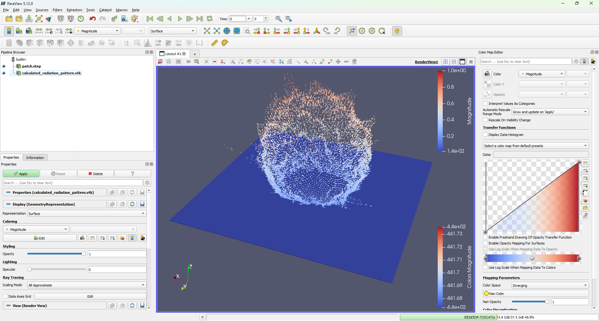

Radiation pattern
=================
This is experiment to obtain radiation pattern. For now plotting E field magnitude using sphere around patch antenna to get E field pattern. Any ideas how to calculate far field are welcome.

